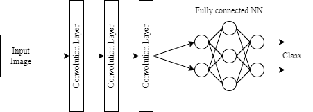
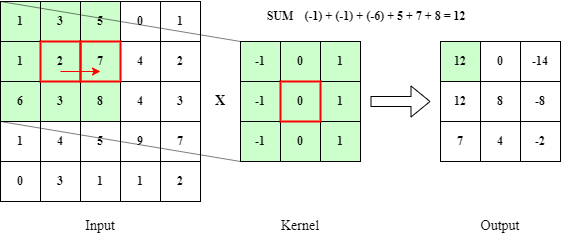
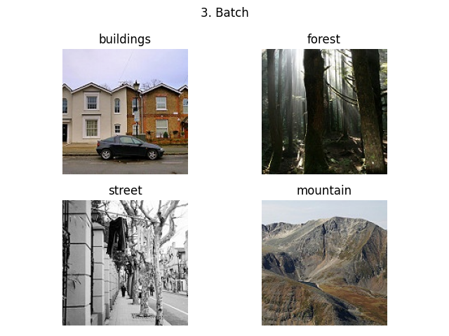

# Convolution Neural Network

CNN is used for computer vision. In this case the network will determine what is on a 150x150 image. There will be a total of 6 classes (buildings, forest, glacier, mountain, sea and street). The dataset is available on https://www.kaggle.com/datasets/puneet6060/intel-image-classification.

## Topology

Topology of a CNN can be separated into 2 parts. First one is a convolution part with convolution layers and after that there is a classification part with fully connected neural network.

### Convolution layers

Convolution is a linear operation which uses a kernel. This kernel is applied onto the input image resulting into a feature map. The kernel is moving pixel by pixel (if the step is set to 1) and its new value is calculated with affection on its neighbors. This way is kernel applied onto the whole image resulting into new one. The size of the new image depends on several factors. These are size of the kernel, moving step and if there was added padding. Generally speaking the output size will be smaller or the same, but cannot be the same without padding.

The purpose of these kernels is to capture some patterns in the image. Lets say we have a kernel that is designed to capture horizontal lines. In the output image the places where are horizontal lines will be most active. Each convolution layer uses multiple kernels which results into multiple feature maps. These maps are input for the following layer, which finds patterns in the already existing ones (it is looking for more complex shapes). The feature maps from the last convolution layer serve as input into fully connected neural network.

What technique is also typically used in CNN is max pooling. This operation is applied on a feature map before passing it to the next layer. What max pooling does is simple. It has specified size of pixels and from this area it takes the maximum values. The main benefit of this techniques is that it reduces the size of the feature maps. Smaller features maps means more effective calculation with them.

### Fully connected neural network

The goal of this network is to make a classification based on taken feature maps. The network is trained to recognize classes (objects) based on their features. Type of this network could be the typical supervised model with error back propagation learning algorithm.

## Implementation

### Topology

There are 4 convolution layers. First 2 use 5x5 kernel with 2 cell step. The other ones use 3x3 kernel with 1 cell step. After these two there is also max pooling with 2x2 kernel and 2 cells step (reduces the size of feature map to half). This convolution topology very quickly reduces the size of feature maps for faster computation.

For classification there is a 3 layer fully connected NN.

As an activation function all of the layers (except the last classification one) use leaky ReLU. In addition to usage of leaky ReLU classification NN uses dropout technique. The reason for this is to give the network better environment to learn.

### Functionality

Because images for predicting / application are not labeled only user can confirm if the model predicted the image right. For this purpose there is implemented batch (size of 4) showing with matplotlib. The models prediction is placed as the image title.

There are also implemented functions for creating and training a model or for loading a existing model. The training process is controlled by users input of maximum number of epochs and error rate. If one of these conditions is matched the training ends. On top of that user can specify the learning rate and if the model should be saved. Model saving and loading was done with pytorch functions.

### Existing Model

Model in this dictionary has 85.4% testing accuracy. This is kinda low for this little number of classes but some of the classes are very similar plus tuning of the model is very time consuming procedure. I gave it a couple of shots with different topologies and some parameters.

## Notes

- With ImageFolder, labels are assigned based on the subfolder from which the image was.
- Softmax is applied inside the CrossEntropyLoss.
- Saving a model will remove the previous one (if one exists).
- More complex topology had worse accuracy than more simple one.
- Be careful for overfitting.